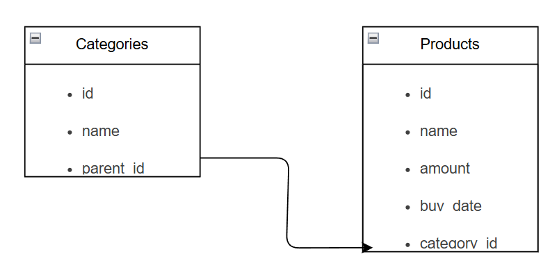

# Welcome to "The Brain"

This file will contain the day to day information from the development of this project. In here we will find the tasklist for each programming session needed to finish this project until it's last version. 

# Some Important Notes...

Even though I'm a computer systems engineer, my main knowledge and skills are Linux and networking. Nevertheless, web-dev is something I actually find very fun and fulfilling to do, so, I'm on the learning curve of Laravel and React, for this reason:

- If you find anything that can be improved or enhanced, please contact me on my socials (posted on my main GitHub repo), I'm an eager learner.
- The project will be done using different kinds of AI to guide me through the process, however, the main foundation of my journey will rely on official documentation pages (From PHP, Laravel, React and so on). 
- On here I'll try to post my development process, however, beware that this file might be **CONSIDERABLY LARGE**, as I'll try to post literally every step just like a vlog, as time passes by I´ll add some indexation and sectioning on the file so neither you or me gets lost.
- I'll do my best to be consistent and upload at least something minimal the days I have little time or when I don't feel with enough motivation so I force myself to build and improve my discipline.
- Feel free to clone this repo and make it your own if you're on the learning pathway as well, tweak, modify and create your own features so you can make it yours.

# About the program

This program is called "HomeControl". The idea comes from the basic need of knowing the amount of things you have at home just like an enterprise needs a control or inventory of all its assets. Whether if you're the head of the family or you're on the process of turning into one, knowing what things or products you have in your fridge, in your laundry room, in the pantry, in your room and so on is essential so you never get yourself on a position where you don't have what you need to perform your activities for a lack of diligence. As time passes by more features and ideas will make the program strong enough so you even find a value out of it.

For now, without further ado, let's get to it.


# First dev-sesh -> Date: 2/07/2025 1:46 P.M

## Tasklist

- Design and draw our database
- Stablish connection between Laravel and our databse 
- Define our tables, their relationships and cardinality
- Craft some factories and seeders so we populate our databse with some fake information

Once we have Laravel, PHP, NodeJS and MySQL Workbench installed, what I'll do is to create my database structure straight away. According to [1](https://pdfs.semanticscholar.org/6d5d/afe0d94099d2731e25f790a224dc7fb40fd7.pdf), agile development doesn't require exhaustive planning and there is no general rule. So the logic for this is simple; if I want the program to be ready as fast as possible, what I need to do first is to determine how data will be organized and stored so I can start filling it, right?  This is why designing our databse is the stepping stone.

### Database design

At first, I had thought about a database structure I considered was "practical" for modeling the data that was gonna be entered to the program, My initial database structure was this:

*Pool_Product*
- ID
- Name
- Amount
- Buy Date

*Laundry_Product*
The same structure as pool

*Kitchen_Category*
- ID
- Name
- Description

*Kitchen_Product*
- ID
- Category ID (References Kitchen_Category's ID)
- Name
- Amount
- Buy Date

*Personal_Category*
Same as Kitchen_Category

*Personal_Product*
Same as Kitchen_Product

*Cleaning_Category* and *Cleaning_product*
Same as the last two

Now, the problem of this was that there were a lot of redundant tables and on the long term, supposing we were to add a new category or even a sub-category, all tables would need to be modified. For this reaso, after analizing along with ChatGPT for a better way of organizing the DB structure, we got to the next schema:

*Categories*
- ID
- Name
- Parent_id 

*Products*
- ID
- Name
- Amount
- Buy_date
- Category_id

Now, "Parent_id" on the *Categories* table will be useful when for example, I have shampoo and charcoal face mask. We can all agree that they belong to the personal category, if we get more specific it can fall into the bathroom category but even then, they both correspond to a different sub-category. This field will be nullable as there might be some categories that don't need any other kind of categorization. The "Categpry_id" will be used to reference the ID of the category that the product belongs to. 

Once we've defined the structure of our database, it's time for us to draw it so we can keep a register and have an easy way to visualize it. To do this, we don't actually need to leave Visual Studio Code (the IDE I'm currently using), there's an extension called "Draw.io Integration". Once we install it, we only need to create a file like this: *foo.drawio* and the editor will open a window that after some seconds shows you the different elements to draw your diagrams. This is how our databse is looking so far:



### Stablish connection between Laravel and our database

To connect our Laravel app with out DB we have to modify first the *.env* file. This file is in charge of managing the environment variables on our app, we can find this file on our root project folder. In here we can find information about our app name, aws keys and mail servers. In my case, I will change the name of the app to "Home Control", when our app has a name that is made out of two or more words we have to use double quotes so the file doesn't crash according to Laravel's official documentation.

After some scrolling we will find the next block of code:

```bash
DB_CONNECTION=sqlite
# DB_HOST=127.0.0.1
# DB_PORT=3306
# DB_DATABASE=laravel
# DB_USERNAME=root
# DB_PASSWORD=
```

This is the section we're interested in. To set up the connection we must follow the next steps:

1. Uncomment all lines from this code block
2. Change the database name to the one we're using (mysql,mongodb,postgresql,etc)
3. As we're developing locally, the next two lines remain the same
4. We type on the third line the name of our database. **IMPORTANT!!:** the database **MUST** be already created on our DBMS.
5. The last two lines will depend on the configuration we selected during our database manager installation. In the vast majority of cases the user is always root and the password is blank, however, if you're using mysql or postgres you might need to specify the password that the DBMS prompts you when you want to enter to any of the connections you created. **IMPORTANT NOTE:** it's recommended and a good practice to write your password inside single quotes always but specially when your password contains any special character, this helps Laravel to not crash once again. It should lool something like this:

```bash
DB_CONNECTION=mysql
DB_HOST=127.0.0.1
DB_PORT=3306
DB_DATABASE=homeinventorydb
DB_USERNAME=root
DB_PASSWORD='password#'
```

To test if the connection was performed succesfully, we open a terminal window and we type:

```bash
php artisan migrate
```

If everything went all right you will see something like this on our terminal:

```bash
 INFO  Running migrations.  

  0001_01_01_000000_create_users_table ..................................................................... 90.99ms DONE
  0001_01_01_000001_create_cache_table ..................................................................... 29.82ms DONE
  0001_01_01_000002_create_jobs_table ..................................................................... 141.14ms DONE
```

If you didn't see this and you got something like "The database doesn't exist" or something like that, check for typo mistakes and also, remember that on the main DBMS, the name of your connection is not the same as the database name, typically they're not case sensitive so if your DB connection is called "myDB", it's very likely your DB is named "mydb".

Another important fact is that if you make a migration and for any reason you repent, you can always type the command:

```bash
php artisan migrate:rollback
```

Or if you want to reset all your apps migrations you can type:

```bash
php artisan migrate:reset
```

Once everything is working fine, if we look into our DBMS, in my case MySQL Workbench, we refresh the database and we will find three additional tables created called "users", "cache" and "jobs". If we look closely, it's the output from our terminal once the connection was tested succesfully. 

### Define our tables, their relationships and cardinality

Now that we've stablished a connection with our database, we'll focus on our models and making the migrations for the particular needs of our project. 

First, let's focus on the migrations. On Laravel, we can create a migration without a model. Migrations are in charge of defining the structure of our database (the tables, the columns and keys), on the other hand, the models are in charge of representing the access logic to the data and the interaction with the tables. There are certain ways in which we can create a migration:

```bash
php artisan make:migration create_tableName_table
```

or

```bash
php artisan make:model ModelName -m
```

It's important to note that on the second method, the -m represents the creation of the migration, also, the name of the model is preferred to be written in english and on singular. This is because Laravel then creates the migration with the name in plural, so it's best to write it in singular.

So, taking this in count, let's dive straight into it. It's important to say that the order of creation matters, so, first we must create the tables where we won't have any relation with another table and then, once all of the before mentioned tables are created, create the tables with references. This helps to keep the reference integrity and make development and design easier.

In this case, our app will have only two tables, so we must first create the table with no foreign keys, in this case *Categories* and then *Products*. There might be a need to create more tables on the future, however, as we're following agile development principles, we'll create this tables as they're the ones that will give basic functionality to the site so it can be used as early as possible.

In this case, we will crate our migrations and models using the second command. So we will execute:

```bash
php artisan make:model Category -m
```

and 

```bash
php artisan make:model Product -m
```

Once we execute these commands, if we look into the folder *database/migrations* we can see that our categories and products tables have been created, also, if we move to *app/Models* we will see the models we just created. 

Now the next thing we must do is to create our migrations. In order for us to know what needs to be done first is by first understanding the difference between migrations and models. 

Using the analogy of a house construction, a migration is the architect and workers that are in charge of building the house, its structure, the amount of walls, rooms and what shape will everything have. In other words, a migration tells Laravel how to build a table inside our database. On the other hand, a model, using the same analogy, it's the interior designer, it moves inside the finished structure and is in charge of how to organize things, move things from one thing to another, add or remove stuff that may not fit with the house aesthetics and so on. It lets Laravel talk to our database to retrieve anything we ask from it or to CRUD the data inside it. 

Moving into our *categories* migration, we find the next structure:

```php
<?php

use Illuminate\Database\Migrations\Migration;
use Illuminate\Database\Schema\Blueprint;
use Illuminate\Support\Facades\Schema;

return new class extends Migration
{
    /**
     * Run the migrations.
     */
    public function up(): void
    {
        Schema::create('categories', function (Blueprint $table) {
            $table->id();
            $table->timestamps();
        });
    }

    /**
     * Reverse the migrations.
     */
    public function down(): void
    {
        Schema::dropIfExists('categories');
    }
};

```

This is the default structure given by Laravel when we create a migration. Here, the main logic goes into the "up" function because it's what's gonna happen once we execute the commands to create our tables. On this case, our categories table will only have three fields, see the previous sections for reference. 

Our final structure of the file for now on the create section is this:

```php
    $table->id();
    $table->string('name')->unique();
    $table->foreignId('parent_id')
    ->nullable()
    ->nullOnDelete()
    ->constrained('categories');
    $table->timestamps();  
```

We created the name column unique so categories can't repeat. As said on the database design section, as there might be sub-categories on a main category, each category will have a parent id in case they belong to a broader category, for this reason, this field will act as a foreign key that references the id from the same table. This is why we use the *foreignId* and *constrained* modifiers. This last one is the one that tells Laravel that it's a foreign key referencing the same table. Finally, the *nullable* and *nullOnDelete* are used so a field can have this column empty on the case its a main category, and in order to set the value to null in case the parent id or category is deleted, this turns the child category into a main one. Don't worry if you are not understanding inmediately, with iteration and when we see the functioning of the program it will get clearer.

Now, the structure for our products table is fairly similar, in my case it looks like this:

```php
$table->id();
$table->string('name')->unique();
$table->unsignedInteger('amount');
$table->date('buy_date');
$table->foreignId('category_id')
    ->constrained('categories')
    ->onDelete('cascade');
$table->timestamps();
```

On this case, we also keep the names of the products unique, for the amount of products we use *unsignedinteger*, this modifier makes sure that Laravel only receives positive numbers, we add the date type for our "buy_date" column and finally, for the "category_id" we use two identifiers just as we did on the previous table *foreignId* and *constrained*, this sets up automatically the reference between the column and the table's id we are referencing. Finally, we used the *onDelete* modifier, this allows us to avoid keeping orphan records and make sure that if a category is deleted, all related products are also deleted. We might change this on the future but for now it's staying this way.

Once we got the previous things set up, we must move into our models. First we'll create the *Category* model. The sample structure we are given once the model is created looks like this:

```php
<?php

namespace App\Models;

use Illuminate\Database\Eloquent\Model;

class Category extends Model
{
    //
}
```

After reading the documentation and asking ChatGPT and looking online, our model class looks like this:

```php
    //Line to be able to use factories
    use HasFactory;
    
    //Declaring which fields can be mass assigned
    protected $fillable = [
        'name',
        'parent_id',
    ];

    //Relationship where a category can have multiple products
    public function products(){
        return $this->hasMany(Product::class);
    }

    //Relationship where a category can have a parent category
    public function parent(){
        return $this->belongsTo(Category::class, 'parent_id');
    }

    //Relationship where a category can have multiple children classes
    public function children(){
        return $this->hasMany(Category::class, 'parent_id');
    }
```

Inside our *Category* class we will first add the "use HasFactory". The reason why we do this is because we're gonna populate our database with some dummy data, Laravel gives us the tools to do so with factories and seeders which will be defined and explained in more detail on the next section. However, we use the said line so we can link or indicate Eloquent that our model will be used by factories.

After this line we must define the fields that are gonna be mass asigned, what this refers to is that Laravel might prevent us from modifying multiple fields, for this reason we have to use the fillable property. This is simply a protected array that contain the names of the columns that will be able to be modified or affected massively.

Finally, we define the different relationships that our model has with the different entities on our project. The documentation gives the example functions just like we can see them. The way to understand this so we don't get lost is; one category can have or be linked to:

- Multiple products
- One parent category
- Multiple children categories

This is the reason why we have three methods instead of one, as our *Categories* table has a column that references the same table's id as a foreign key, we create one relationship between the category and a parent and a child. The second parameter we pass to the *belongsTo* (which is used for a one to one relationship) and the *hasMany* (which is used for a one to many relationship) methods is the foreign key or "column" that depends on the main id or primary key.

Now, we must create our *Product* model. This is the way it looks after coding:

```php
<?php

namespace App\Models;

use Illuminate\Database\Eloquent\Factories\HasFactory;
use Illuminate\Database\Eloquent\Model;

class Product extends Model
{
    //Line to link factory files
    use HasFactory;

    //Columns to be assigned massively
    protected $fillable = [
        'name',
        'amount',
        'buy_date',
        'category_id',
    ];

    //Relationship where a product has one category
    public function categories(){
        return $this->belongsTo(Category::class);
    }
}
```

As we have seen previously, everything remains the same, in this case we only have one method or functions because we only have one relationship between another table.

To apply our changes and see our tables on our DB we run:

```bash
php artisan migrate
```

### Create some factories and seeders to pupulate our DB

As it has been mentioned before, on the development process, there are times when we need to perform some tests or check how the real structure of our database looks like in order for us to perform changes on the design if needed or just to test other functions. This process can be done manually, however, when the amount of records increase it becomes unefficient. Using factories make it faster and also helps to centralize the object creation. In order for us to become more familiar with this process, we must first understand what is a factory, a seeder and their difference, to do it foolish friendly (like me) we will use an analogy.

A factory is basically the blueprint of how the data will be inserted and how data should look on a row. On some military operations snipers are accompained by tactical units called spotters, specially when the objective is to hit targets at superb distances with extreme positions, these units use binoculars and through them they are able to know the wind force and directions, the distance of the target, elevation and many other factors, the thing is that the spotter doesn't shoot anything, it's the sniper that uses that information and shoots. In our case, the factory is the spotter and the sniper is the seeder. A seeder is what actually executes the object creation, it doesn't really know much about the database structure, it just shoots information using the factory's blueprint.

We have to create a factory file for each one of our tables. To create them we use the command:

```bash
php artisan make:factory NameFactory -m ModelName
```

or 

```bash
php artisan make:factory NameFactory --model=ModelName
```

The order matters as Laravel uses naming conventions to allow us not to worry about things it can manage automatically.

**Side Note**

When we are not sure of how to use a command or what are all the possible flags of that command we can use:

```bash
php artisan help command:argument
```

For example, if we wanted to see how to use all options from the command to create factories we would write:

```bash
php artisan help make:factory
```

This will show us all possible flags to be used with this command.

Once we execute our commands, when we move to *database\factories* we can see our newly created factories. In this case we will move to our *CategoryFactory*. The structure of our file looks like this:

```php
<?php

namespace Database\Factories;

use Illuminate\Database\Eloquent\Factories\Factory;

/**
 * @extends \Illuminate\Database\Eloquent\Factories\Factory<\App\Models\Category>
 */
class CategoryFactory extends Factory
{
    /**
     * Define the model's default state.
     *
     * @return array<string, mixed>
     */
    public function definition(): array
    {
        return [
            //
        ];
    }
}

```

When we're creating our factories we're gonna use a lot of the [Faker Methods](https://fakerphp.org/formatters/numbers-and-strings/), this class is the one that help us to create our fake data. On this files, the important stuff is written inside the *definition* method, particularly inside the return array. At the end of coding our file looks like this:

```php
'name' => fake()->unique()->word(),
//We insert 70% main categories and 30% child categories
'parent_id' => fake()->boolean(30) && Category::count() > 0
? Category::inRandomOrder()->first()->id
: null,
```

As we can see, on the left we need to indicate the column name that we will insert data into, then, on the right side of the arrow we first declare our fake class and then we use the object operators to access its methods. We have to remember the constraints we defined on our migrations so the data matches what our DB is expecting to receive on every column. On the case of the name, we stablish that we will insert unique names or words. For the *parent_id* field the thing changes a little. After instanciating the faker object we call the *boolean* method, this method is just basically the chances of getting something, in addition to this we use the AND operator using the double amperstand to verify that our table has at least one row using the *count* method. After the question mark (typically used to indicate what happens if the conditions are true) we retrieve and insert any of the ids from the table with the *inRandomOrder* method, and we get the first result that pops up with the method called *first*, after the double colons (used to determine what happens when the result of the conditional is false) we just type null to indicate that the column will receive a null value. 

And that's it, it's not something difficult to do, it's only tedious and mostly if we have more than two tables. Now let's analyze the factory for the products.

```php
'name' => fake()->unique()->word(),
'amount' => fake()->numberBetween(1,100),
'buy_date' => fake()->date(),
'category_id' => Category::query()->exists()
? Category::inRandomOrder()->first()->id
: Category::factory()->create()->id,
```

Quick explanation here as we already discussed the main idea before; on the *amount* field we use the *numberBetween* method and not *randomNumber* because the last one can generate ridiculously big numbers and on the context of our project that would be unrealistic, on the *buy_date* column we use the *date* method, according to the documentation, by default the format of the date is *Y-m-d* but it can be changed to *Y_m_d*. Finally on our *category_id* field we use a similar approach as in the previous factory, we first evaluate if the **Category** table has registers on it. If they do, we once again take any random id from the table, in case it doesn't exist, we create it inmediately. Now, **IMPORTANT**, the solution we proposed on the false case (there's not any registry on the DB) only works because we have previously created a factpry for our categories. This leads us to the conclussion that we have to work and create the most independent tables first down to the ones with one or more references to another tables.

Now we're ready to create our seeders and execute them afterwards, and now you will see why creating the factories makes it a lot easier. To create our seeders we could use the existing file located on *database\seeders\DatabaseSeeder.php*, however, as time passes by, we may want to apply certain constraints to our seeds depending on the needs of the project, if it's in production, if we're testing a new feature or many other cases. For this reason, the best practice is to create a seeder file for each one of our tables as well. To do this we just have to execute the command:

```bash
php artisan make:seeder NameSeeder
```

Once we've executed the commands and we got our seeders file created, let's move straight away into our *CategorySeeder*.

```php
<?php

namespace Database\Seeders;

use Illuminate\Database\Console\Seeds\WithoutModelEvents;
use Illuminate\Database\Seeder;

class CategorySeeder extends Seeder
{
    /**
     * Run the database seeds.
     */
    public function run(): void
    {
        //
    }
}

```

As we can see, this is the default structure of our seeder file, the documentation says that the run method is the one called when we execute the command to seed and populate our DB. In here we could have two different approaches, one is to manually insert data using the query builder, the other one is way faster using Eloquent model factories, which is what we were just doing some moments ago.

The documentation says that we create our seeders like this:

```php
Category::factory()->count(50)->create();
Product::factory()->count(70)->create();
```

In here, the only thing we're saying is; from my Category/Product models, use their factory a number of n times using *count* and create registers.

Finally, we move into our *DatabaseSeeder* file, we erase the example of the *User* class and we type this:

```php
$this->call([
    CategorySeeder::class,
    ProductSeeder::class
    ]);
```

Again, the only thing we're doing here is to create an instance of the DatabaseSeeder class ato indicate that it will execute the given seeders using the *call* method.

Finally, to seed our database we only need to use the command:

```bash
php artisan db:seed
```

If everything was done correctly we must see something like this on the terminal:

```bash
 INFO  Seeding database.  

  Database\Seeders\CategorySeeder ................................................................................................ RUNNING  
  Database\Seeders\CategorySeeder .......................................................................................... 1,577 ms DONE  

  Database\Seeders\ProductSeeder ................................................................................................. RUNNING  
  Database\Seeders\ProductSeeder ............................................................................................. 503 ms DONE  
```
Finally, to check everything is all right, we go into our DBMS and we refresh to see the records. We might have to run a simple query (as on my case that I'm using Workbench), a simple:

```sql
select * from categories
```
will make it.

After doing so I realized that on the *Categories* table, I got null on all the *parent_id* registers, while it's true that we specified a 30% of chance of getting a parent id, it's always good to check that everything is working fine. The solution for this will be to modify for a moment our CategoryFactory and then, only execute the CategoryFactory to leave the products table unaltered. 

Once in our factory file we're gonna copy and paste the logic of the *'parent_id'* field. We comment the code block that we already had and we will modify the newly pasted block so it remains something like this:

```php
 'parent_id' => Category::inRandomOrder()->first()->id, 
```

We save our file and finally, we're gonna execute the next command:

```bash
php artisan db:seed --class=CategorySeeder
```

This command is found on the documentation and it only executes the seeder for the class we're specifying. Well, after executing the command multiple times, I always find the same error, the faker dictionary for words repeats at least one of the words that have already been stored in the database, and as we have a unique constraint, it cannot be done. For this reason, we're gonna use another command:

```bash
php artisan migrate:fresh --seed
```

What this will do is that it will drop all our tables and re-run all migrations, however, we must modify our factory again to only allow it to insert the parent id when there is at least one register. To do so we will make the file to look like this:

```php
'parent_id' => Category::count() > 0
? Category::inRandomOrder()->first()->id
: null, 
```

On this case we're only recycling one of the conditionals on our original code block had which makes sure there's at least one registry.

After executing the command and looking at the database again, it's still having null on all registers even though we changed the condition. After chatting with ChatGPT, he proposed the following:

1. Letting the logic for the factory as it was to leave the factory file sinple, like this:

    ```php
    'name' => fake()->unique()->word(),
    'parent_id' => null, 
    ```

2. Modifying the seeder class (here we can see why it's important to create a dedicated seeder file for each table). Apparently the problem is that at the time Eloquent is seeding the database, the count on the condition we had was always false, turning into null all parent ids on all registers. He suggested to add this block of code:

    ```php
    $categories->random(round($categories->count() * 0.3))->each(function ($category) use ($categories) {
    $parent = $categories->where('id', '!=', $category->id)->random();
    $category->update([
            'parent_id' => $parent->id,
        ]);
    });
    ```
    Breaking this whole thing down, this is what it does:

    - **$categories->random(round($categories->count() * 0.3)):** Let's use math hierarchy to understand this, in general this part selects randomly 30% of the created registers. The *$categories->count()* is 50, the amount of entries, when multiplied by 0.3 we get that 15 categories will have a parent id, the *round* makes sure it's a whole number and finally the *random* receives 15, which means that 15 random categories will have a parent id.
    - **->each(function ($category) use ($categories):** This part is a loop, what it does is that it iterates over each of the 15 selected random categories and it executes a function on each one of them with *function ($category)*, it also uses the full collection of categories or registers via *use ($categories)*, this is because they will be used on the function that will be executed on every 15 random registers.
    - **$parent = $categories->where('id', '!=', $category->id)->random();:** What this line does is that filters out the current category so it doesn't place itself as a parent category (using the *where* clause to all 50 categories and it checks that the id is not (*'!='*) itself (*$category->id*) remember category is the name of the current object being handled by the loop), and selects a random category from the remaining 49 registers to be its parent.
    - **$category->update(['parent_id' => $parent->id,]);});:** Finally, it updates the current category (*$category->update*) with the id of the randomly selected parent.

2. Execute again the command:

```bash
php artisan migrate:fresh --seed
```

And after doing these steps, the thing worked. 

Now, in order to keep track of our changes and to publish every dev-sesh it's time to push the project into git and GitHub. I think Laravel asks when creating the app if we want to initialize a git repository, if you selected to do so, if you run:

```bash
git status
```

Your output will show some files in red that indicate that the files haven't been added to the commit queue yet. If you didn't select to initialize a git repo it will show something like: "There is not a git repository here". If that's the case we type the command:

```bash
git init
```

Then, we execute the command:

```bash
git add .
```

What this will do is to add to the queue all the files on this directory (except the ones declare on the *.gitignore* files). In my case, after I ran this command, I got the next messages:

```bash
warning: in the working copy of 'logbook/database.drawio', CRLF will be replaced by LF the next time Git touches it
warning: in the working copy of 'logbook/logBook.md', CRLF will be replaced by LF the next time Git touches it 
```

This is basically an end of line conflict, they are handled differently by Unix and Windows. This happens because the main functioning of git is through a Linux environment. This isn't actually a big deal but as we are working with the best practices we're gonna solve this issue so everything runs smoothly.

First we installed the binaries of [unix2dos](https://sourceforge.net/projects/unix2dos/) on a folder in our system. What we download here is a zip file. Once we extract the four executable files we open a new terminal window on this location and in there we can already type the next commands:

```bash
.\unix2dos C:\Programming\Web\HomeControl\logbook\database.drawio
.\unix2dos C:\Programming\Web\HomeControl\logbook\logbook.md 
```

This resolves the line end conflict and we're good to go. Finally, before we push our project we have to commit our changes locally. To do so we use the command:

```bash
git commit -m "Initial commit: Project setup, with migrations, models, factories and seeders"
```

Now it's time to push our changes to our GitHub repo. To do this we must first create an access token in our GitHub add because the username password authentication is deprecated. Doing this is quite straightforward. In our GitHub main page we click our **profile pic** to show the menu, then we click **Settings**, then we scroll down and click **Developer Settings**, then we collapse the options on **Personal access tokens** and select **Fine-grained tokens**, then **Generate new token** and we will be shown a forms where we will insert the name of our token, a brief description, the expiration time (I recommend leaving the 30 days). On repository access I always choose All repositories so I don't have any constraint. On the permissions, I set the read and write to the next categories:

- Administration
- Contents
- Deployments

And leave the account permissions as they are. Finally we click on **Generate token** and we will be given our token. We must copy and paste this token somewhere accessible and don't loose it because we won't be able to retrieve it. What I do typically is to paste it on my project folder and update the *.gitignore* file so it doesn't get pushed to the public remote repo.

Once we´re done we do the following:

1. We execute:
```bash
git remote add origin https://github.com/GusRosR/Home-Control.git
```

This points git to the repo we want to push.

2. We execute:

```bash
git branch -M main
```

This renames our local main branch to match the name of the remote main branch.

3. We execute:

```bash
git pull
git push -u origin main
```

This updates what's on the remote repo first and then we push what we have.

# Second dev-sesh -> Date: 3/07/2025 4:32 P.M
## Tasklist

- Create and understand controllers
- Create and understand routes
- Create our first dataTable in react and fetch our DB info
- Create our form to insert registers to the DB.
- Link the index file with the forms to push data to the DB

### Create and understand controllers

As before, it's important to first understand what a controller is and what it does in our application. Once again using an analogy, we can imagine a restaurant where we have recipes (our models), the pantry with labels and containers for organization (our migrations) and the ingredients we have to cook our food (our factories and seeders). A controller in our restaurant is the head waiter, they take an order from a customer (the browser), then it moves to the kitchen (our model), there he gets the food (our data) and maybe tell the chef to cook something (CRUD) and finally it takes it back to the customer. Notice how our controller is not actually cooking or disposing anything, it's only the middleman that understands the request, know what to do with it and who to talk to so it can be completed successfully. Talking on technical terms, our controller receives a request from the browser and passes the instructions to the routes to know what do do and the models or database that are who actually do the job.

According to the documentation, there are multiple ways in which we can create a controller, however, as we're using react for our frontend, we will create the controllers using the resource flag:

```bash
php artisan make:controller CategoryController --resource
php artisan make:controller ProductController --resource
```
What this will do is that it will create inside our controller all our CRUD methods we'll need to allow the user to interact with out app. All our controllers are found on the *app/Http/Controllers* folder. Now, let's take a look at our CategoryController:

```php
<?php

namespace App\Http\Controllers;

use Illuminate\Http\Request;

class CategoryController extends Controller
{
    /**
     * Display a listing of the resource.
     */
    public function index()
    {
        //
    }

    /**
     * Show the form for creating a new resource.
     */
    public function create()
    {
        //
    }

    /**
     * Store a newly created resource in storage.
     */
    public function store(Request $request)
    {
        //
    }

    /**
     * Display the specified resource.
     */
    public function show(string $id)
    {
        //
    }

    /**
     * Show the form for editing the specified resource.
     */
    public function edit(string $id)
    {
        //
    }

    /**
     * Update the specified resource in storage.
     */
    public function update(Request $request, string $id)
    {
        //
    }

    /**
     * Remove the specified resource from storage.
     */
    public function destroy(string $id)
    {
        //
    }
}

```

Now, as we can see, all methods have been created. 

The main intention of this file is to tell Laravel what to do when the user gets to one of our endpoints, like home-control/categories and so on. 

Each one of the operations declared on this file are the most commonly used functions inside a program with user interaction. Let's go step by step watching what each method looks like in their final form and why they ended up that way.

```php
public function index()
    {
        $categories = Category::with('parent')
            ->orderBy('id', 'desc')
            ->paginate(15); //Retrieves 15 registers at a time
        return Inertia::render('Categories/Index', [ //First parameter -> the view we will render
            'categories' => $categories // Second parameter -> This tells Laravel, after rendering the view
        ]);                             // pass to it a prop called categories, it's value is the paginated Categories
    }
```

The comments on the code make it easier to understand, however, a quick explanation of what happens here is; First we save into a variable all the registers inside our Category database, remember that "Category" in this context refers to one of our database tables, then we use *with* that takes all the registers along with their parent register if that's the case. To understand this better we can look at this part in our model:

```php
//Relationship where a category can have a parent category
    public function parent(){
        return $this->belongsTo(Category::class, 'parent_id');
    }
```

In here, what we told Laravel is: "A category can have only one parent, and this parent is represented by parent_id". So, when we select our registers using "with", it allows us to retrieve also it's related parent so we can then display in our table. Then, with the *orderBy* we sort the data on the table from the newest to the oldest entry, this is really a preference stuff so if you like you can skip this property. Finally with *paginate* we restrict our controller so it only shows 15 registers from our database on each page. This helps us to keep a cleaner look in addition to the fact that we'll ad advanced filtering and/or search mechanisms to interact with our data on the table. After this we use Inertia to render our page, more information about its usage, methods and conventions can be found [here](https://inertiajs.com/). Now, the render method receives two paremeters. The first one is the URL to where we want to get the page to redirect to, the second parameter correspond to the props we want to send to that page when rendering.

**What is a prop?**
A prop or property is nothing more than information that React uses inside its pages. The way we can think of it is like a mail. Inertia::render is basically saying, "Send to this address (our URL) this attachments (our props)". The bennefit of this is that first, the page already has the information when its rendering, which boosts performance (although it can lead to the page not to render if an unexpected error appears), and second of all, it allows us to access the information without having to query inside our page which makes our program cleaner and simpler.

Now, when we pass in the props, the syntax we're using is *key: value*, in other words, theNameWeWantToGiveOurProps => ourPropsVariable. This is important as we're then going to access our props without the dollar sign, by the name we assign here.

```php
public function create()
    {
        $categories = Category::select('id', 'name')->get(); 

        return Inertia::render('Categories/Create', [
            'categories' => $categories
        ] ); //Just returns the view with the forms to add a new category
    }
```

For the create function we will also render a view, typically this method is used to return the view/component/page where our form for adding records to the database is. In this case, we use once again a variable to store a query performed with eloquent queries. In here we do a normal select to our table, the only difference is that we only retrieve the id and name columns as they're the only values we're gonna be needing. The get method is used so we can get the actual collection of data and not just an instance of our model (as it would happen if we used *find()*). Finally, once again we pass in that data collection as props to our page. In many cases this wouldn't be necessary, but here we are doing it because we're gonna use a select component that will be populated with records from our DB, however this approach may not always be needed.

```php
public function store(Request $request)
    {
        try {

            //We create rules to validate input data
            $validated = $request->validate([
                'name' => 'required|string|max:150',
                'parent_id' => 'nullable|exists:categories,id', //Makes sure that matches an actual id on the table if filled
            ]);

            Category::create($validated); //Creates a record with sanitized data

            //Redirect the user back to the index with a success message
            return redirect()
                ->route('categories.index')
                ->with('success', 'Category created successfully!');

        } catch (\Exception $e) {

            //Take the user to the previous page and return the error message
            return redirect()
                ->back()
                ->with('error', 'Failed to create the category: ' . $e->getMessage());
        }
    }
```

This method is the one used to handle the logic for inserting data into our DB, it receives the request made by the browser and stores it in a variable that we'll use later. The first thing we do is to take the request of the browser and validate that the data being pushed follows our criteria defined inside the *validate* method array. We can add as much validation as we need and it's best recommended to add it on this file as this is server-side. After retrieving this validated data we create the record inside our DB using the *create* method. If the creation goes as expected, we redirect our user to the index so we can see the created record in our table, finally on this section, we use the *with* method to send a message that we'll use later. On the other section, we use the *Exception* class so we can then retrieve the error message in case anything fails unexpectedly. Inside this block we will redirect the user back (the form view) and we send the error message.

